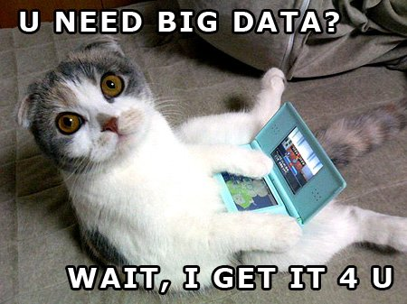
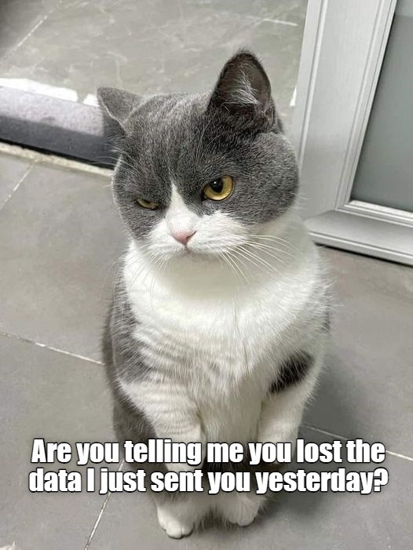

```{r setup, include=FALSE}
library(knitr)
opts_chunk$set(echo = TRUE)
```

## R Markdown

This is an R Markdown document. Markdown is a simple formatting syntax for authoring HTML, PDF, and MS Word documents. For more details on using R Markdown see <http://rmarkdown.rstudio.com>.

When you click the **Knit** button a document will be generated that includes both content as well as the output of any embedded R code chunks within the document. You can embed an R code chunk like this:

```{r cars}
summary(cars)
```


```{r}

```


## Code chunk options

Your R Markdown is broken up into 'code' chunks and text or 'markdown' chunks. Making nice looking R Markdown documents means understanding how to format your code chunks and markdown chunks appropriately.

<https://yihui.org/knitr/options/>

```{r options, echo=FALSE}

library(tidyverse)
load("../data/processed/Dayflow.RData")

ggplot(Dayflow, aes(x = Date, y = SAC)) + geom_line()

```

## Formatting Markdown chunks

A few hints for the markdown chunks:

-   You need two carriage returns to start a new line.
-   Asterisks or dashes make bullets
-   Hash tag indicate headings
-   You can use html for fancy formatting
-   css sheets are used for very fancy formatting (not covered here)
-   Use backticks to put code in text blocks `function(x)`

R Markdown is an easy-to-write plain text format for creating dynamic documents and reports. See [Using R Markdown](https://rmarkdown.rstudio.com/) to learn more.

## Figures

You can include figures in a text chunk

image: {#id .class width="300"}

Or you can include them in code chunks.

```{r Figure, fig.height=4, fig.align="center", fig.cap="Alt text here", echo=FALSE}



```

By default, tables just print like they do in the consul when you knit the document

```{r table}
test = data.frame(Year = c(2000:2023), X =c(0:23), Y = c("Apple", "banana", "cheese"),
                  Z = c(exp(1), pi, exp(2)))

print(test)


```

You can do better with the `kable` function in the `knitr` package

```{r kable, results = 'asis'}


kable(test, format = "pipe", caption = "A prettier table", digits =2, padding =2)

```

You can make interactive and sortable tables with the `DT` package. <https://rstudio.github.io/DT/>

```{r DTtable}
library(DT)

datatable(test, filter = "top", class = "cell-border stripe")

```

## Further Reading

There are lots and lots of extensions you can add to your markdown documetns to make them really, really spiffy. A few examples:

-   HTML widgets such as `leaflet` for [maps](https://rpubs.com/jcheng/leaflet-layers-example) - <https://cran.r-project.org/web/packages/leaflet/index.html>
-   Interactive [dashboards](https://gallery.shinyapps.io/cran-gauge/) - <https://pkgs.rstudio.com/flexdashboard/>
-   Interactive graphs - <https://cran.r-project.org/web/packages/dygraphs/index.html>
-   Web books ([bookdown](https://pkgs.rstudio.com/bookdown/articles/examples.html), up next)
-   [Shiny](https://shiny.posit.co/r/gallery/) web apps (coming up soon)
-   <https://rmarkdown.rstudio.com/gallery.html>
